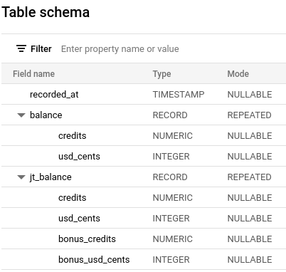

# HG-BigQuery-Export

Export your Honeygain balance to a BigQuery database!

## Setting up

### 1. Creating the BigQuery database

Create a new GCP Project (if desired) and create a new database + table with the following schema:



### 2. Downloading access credentials

Create a new service account in GCP, give it permission to modify your BigQuery database, and download its service
account key in JSON format. Drop it into the root of this project and save its name somewhere.

### 3. Configuring

Copy `config.py.example` to `config.py` and open it in a text editor.

Next, set the following variables:

- **HG_EMAIL**: Email for your Honeygain account
- **HG_PASS**: Password for your Honeygain account
- **GOOGLE_APP_CREDENTIALS**: Path to your service account key, relative to the root of this project. Use the file from
  the previous step for this value.
- **TARGET_DB**: Resource name of the database table you created in step 1.

### Running

Run the following commands to install dependencies:

```shell
# Create venv
$ python3 -m virtualenv venv
$ source ./venv/bin/activate

# install deps
(venv) $ pip3 install -U -r requirements.txt
```

To run the program:

```shell
(venv) $ python3 import.py
Logging in with saved token
Retrieving account balance...
Inserting data into BigQuery...
Done!

(venv) $ deactivate
```

The program will store a single row in your database table, if you want it to monitor for extended periods of time,
please use a solution such as cron to run it once every x minutes.
